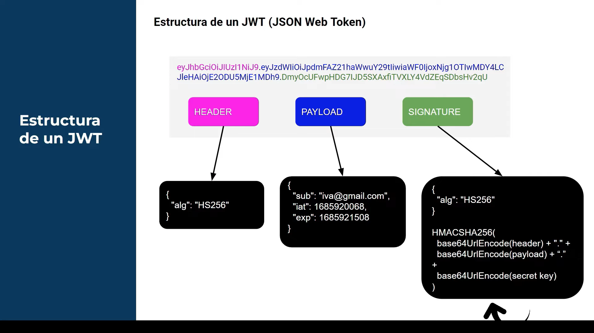
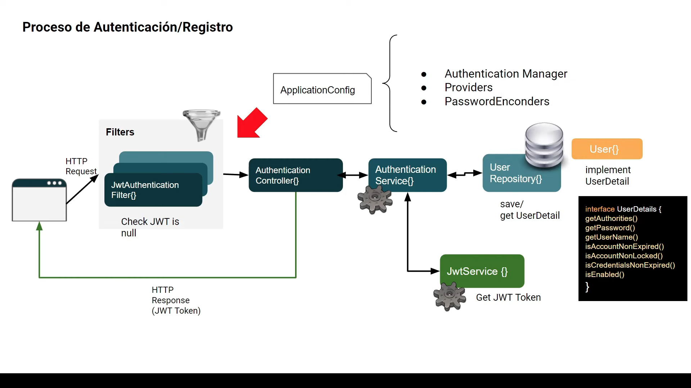
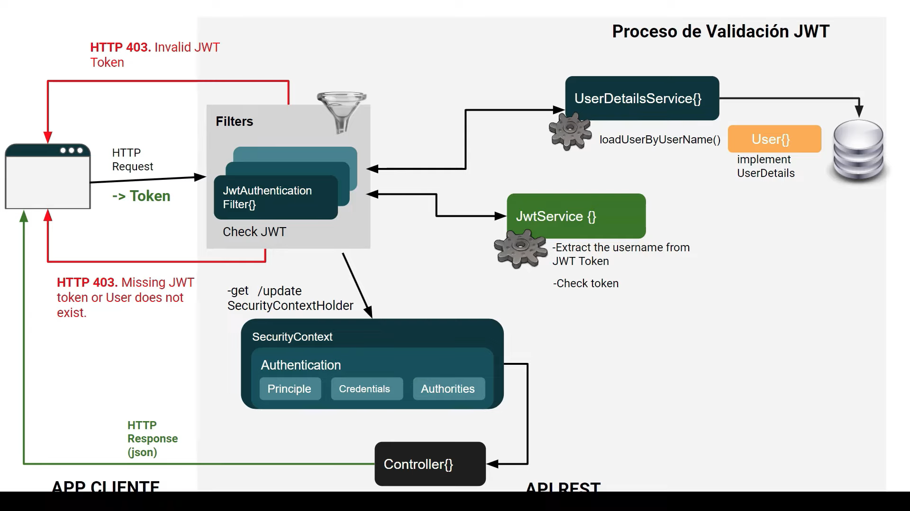
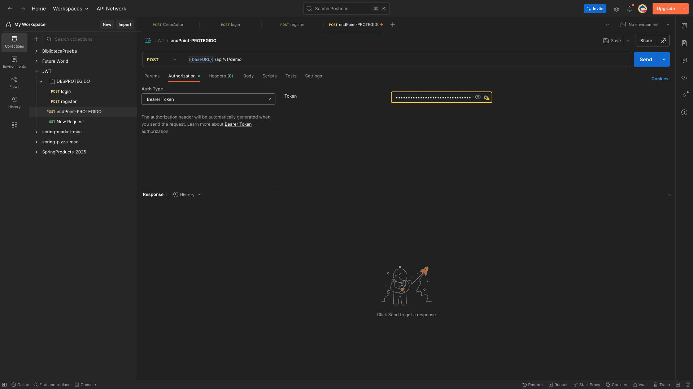

# LOGIN JWT

### Estructura de un jwt

### Diagrama Registro

## CLASES DE CONFIGURACIÓN SecurityConfig & ApplicationConfig

### Proveedor de Autenticación 
#### .authenticationProvider(authProvider)

`src/main/java/com/belos/jwt_demo/Config/SecurityConfig.java:40`

Configurar el proveedor de autenticación (authenticationProvider(authProvider)) es necesario porque define cómo se validan las credenciales de los usuarios en tu aplicación. El AuthenticationProvider es responsable de autenticar las solicitudes de inicio de sesión, verificando usuario y contraseña (u otros métodos, como JWT).

Sin esta configuración, Spring Security usaría el proveedor por defecto, que puede no estar adaptado a tu lógica personalizada (por ejemplo, autenticación con JWT, base de datos propia, etc.). Al configurar tu propio proveedor, aseguras que el proceso de autenticación se ajuste a tus necesidades y controles cómo se validan los usuarios.

### Añadir Filtro antes
#### .addFilterBefore(jwtAuthenticationFilter, UsernamePasswordAuthenticationFilter.class)

`src/main/java/com/belos/jwt_demo/Config/SecurityConfig.java:41`

En Spring Security, las solicitudes pasan por una cadena de filtros antes de llegar a tu lógica de negocio.
Cada filtro realiza tareas específicas (autenticación, autorización, etc.) y el orden importa porque algunos filtros dependen de lo que hicieron los anteriores.

Cuando usas `.addFilterBefore(jwtAuthenticationFilter, UsernamePasswordAuthenticationFilter.class)`, le dices a Spring:
"Coloca mi filtro JWT justo antes del filtro que maneja usuario y contraseña."

Así, tu filtro procesa la solicitud primero (por ejemplo, validando el token JWT) y, si es necesario, luego el filtro estándar de usuario y contraseña actúa.
Esto asegura que la autenticación por JWT se evalúe antes que la autenticación tradicional.

---

Se añade `.class` porque en Java es la forma de referirse al objeto de tipo Class de una clase específica.
En este contexto, `.addFilterBefore(jwtAuthenticationFilter, UsernamePasswordAuthenticationFilter.class)` necesita saber antes de qué clase de filtro debe insertar tu filtro personalizado.
Al pasar `UsernamePasswordAuthenticationFilter.class`, le indicas a Spring Security la posición exacta en la cadena de filtros usando el tipo de clase, no una instancia.

### Definicion de un AuthenticationProvider
#### DaoAuthenticationProvider "Data Access Object"

`src/main/java/com/belos/jwt_demo/Config/ApplicationConfig.java`

es una implementación de `AuthenticationProvider` en Spring Security que se encarga de autenticar usuarios usando datos almacenados en una base de datos (DAO significa "Data Access Object").
Utiliza un UserDetailsService para cargar los datos del usuario (como nombre de usuario y contraseña) y un PasswordEncoder para verificar la contraseña.

En resumen, DaoAuthenticationProvider permite que Spring Security valide usuarios y contraseñas consultando la base de datos y comparando la contraseña ingresada con la almacenada (normalmente cifrada).

## PROCESO AUTENTICACION

## PETICION POSTMAN RUTA PROTEGIDA

